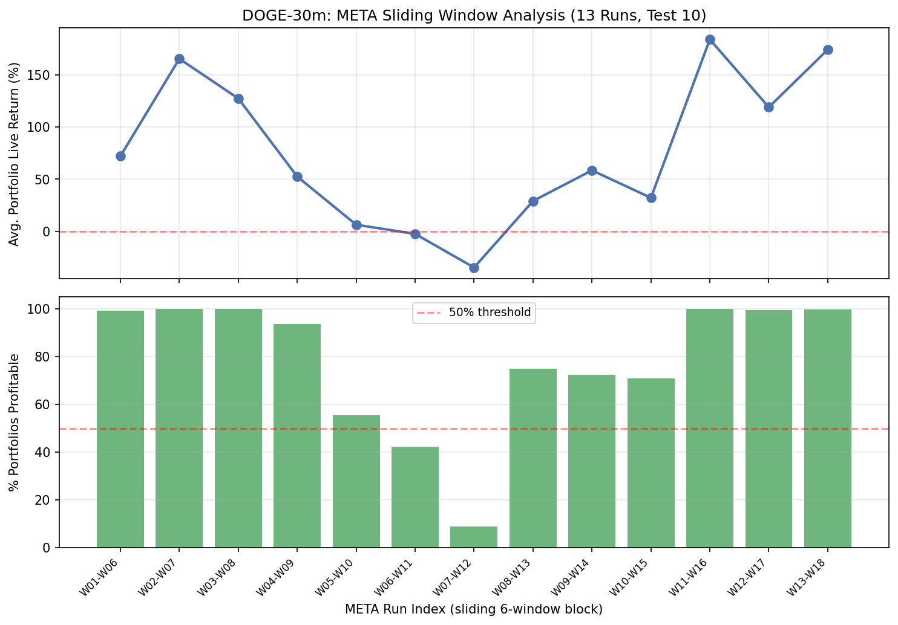
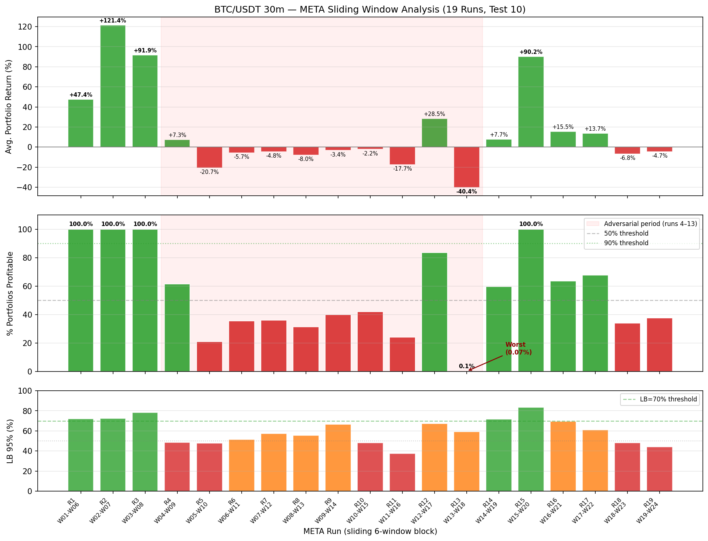

# META Sliding Window Results

These are the main empirical results from running the strategy generalization analysis in META mode — sliding a 6-window evaluation block across the full dataset to stress-test temporal stability across different market regimes.

---

## DOGE/USDT 30m — 18 WFO Windows, 13 Sliding Runs (Test 10)

38,212 strategies evaluated. Each run applies the test 10 robustness funnel independently on its 6-window block, constructs 10,000 random 10-strategy equal-weight portfolios, and reports live-proxy performance on the last 2 windows of the block.

| Run | Windows   | n (pass) | PE (%) | LB (%) | Profitable Portfolios | Avg Return (%) | Avg MaxDD (%) |
|-----|-----------|----------|--------|--------|----------------------|----------------|---------------|
|  1  | W01–W06   |   267    |  81.3  |  77.0  |   9,919  ( 99.2%)    |    +72.1       |     31.8      |
|  2  | W02–W07   |   250    |  80.0  |  75.5  |  10,000  (100.0%)    |   +165.5       |     34.6      |
|  3  | W03–W08   |   174    |  66.1  |  59.9  |  10,000  (100.0%)    |   +127.5       |     26.7      |
|  4  | W04–W09   |   161    |  59.0  |  52.5  |   9,362  ( 93.6%)    |    +52.5       |     30.1      |
| **5** ⚠️ | W05–W10 |  121   |  38.8  |  31.9  |   5,554  ( 55.5%)    |     +6.3       |     37.7      |
| **6** ⚠️ | W06–W11 |   86   |  34.9  |  27.1  |   4,227  ( 42.3%)    |     −2.5       |     38.2      |
| **7** ⚠️ | W07–W12 |   68   |  39.7  |  30.6  |     886  (  8.9%)    |    −34.8       |     63.7      |
|  8  | W08–W13   |    94    |  58.5  |  50.0  |   7,486  ( 74.9%)    |    +29.1       |     47.9      |
|  9  | W09–W14   |   115    |  75.7  |  68.4  |   7,232  ( 72.3%)    |    +58.5       |     56.6      |
| 10  | W10–W15   |   174    |  82.8  |  77.5  |   7,103  ( 71.0%)    |    +32.2       |     43.9      |
| 11  | W11–W16   |   288    |  76.7  |  72.4  |   9,989  ( 99.9%)    |   +184.1       |     47.6      |
| 12  | W12–W17   |   239    |  73.2  |  68.2  |   9,944  ( 99.4%)    |   +119.1       |     46.8      |
| 13  | W13–W18   |   250    |  63.2  |  58.1  |   9,967  ( 99.7%)    |   +174.3       |     46.1      |

> **n** = strategies passing test 10 | **PE** = W5&W6 joint profitability point estimate | **LB** = 95% Beta-Binomial lower bound
> ⚠️ Runs 5–7 = adversarial regime (DOGE/USDT crash period). LB drops below 32%, correctly signalling regime breakdown.
> Pearson correlation between LB and portfolio profitability rate: **≈ 0.96**

---

## BTC/USDT 30m — 24 WFO Windows, 19 Sliding Runs (Test 10)

38,212 strategies evaluated. Same pipeline as DOGE, applied to BTC/USDT perpetual futures at 30-minute resolution (≈ 3 years of data).

| Run | Windows   | n (pass) | PE (%) | LB (%) | Profitable Portfolios  | Avg Return (%) | Avg MaxDD (%) |
|-----|-----------|----------|--------|--------|------------------------|----------------|---------------|
|  1  | W01–W06   |   207    |  77.3  |  72.1  |   9,996  ( 99.96%)     |    +47.4       |     19.4      |
|  2  | W02–W07   |   154    |  78.6  |  72.6  |  10,000  (100.0%)      |   +121.4       |     21.2      |
|  3  | W03–W08   |   206    |  83.0  |  78.2  |  10,000  (100.0%)      |    +91.9       |     18.3      |
| **4** ⚠️ | W04–W09 |  129   |  55.8  |  48.6  |   6,149  ( 61.5%)      |     +7.3       |     32.1      |
| **5** ⚠️ | W05–W10 |  131   |  55.0  |  47.8  |   2,091  ( 20.9%)      |    −20.7       |     36.9      |
| **6** ⚠️ | W06–W11 |  142   |  58.5  |  51.5  |   3,567  ( 35.7%)      |     −5.7       |     38.1      |
| **7** ⚠️ | W07–W12 |  122   |  64.8  |  57.3  |   3,603  ( 36.0%)      |     −4.8       |     35.7      |
| **8** ⚠️ | W08–W13 |   99   |  63.6  |  55.4  |   3,145  ( 31.5%)      |     −8.0       |     48.1      |
| **9** ⚠️ | W09–W14 |   98   |  74.5  |  66.6  |   3,992  ( 39.9%)      |     −3.4       |     52.0      |
| **10** ⚠️ | W10–W15|  122   |  55.7  |  48.3  |   4,208  ( 42.1%)      |     −2.3       |     50.3      |
| **11** ⚠️ | W11–W16|   77   |  46.8  |  37.7  |   2,405  ( 24.1%)      |    −17.7       |     46.3      |
| 12  | W12–W17   |    69    |  76.8  |  67.4  |   8,371  ( 83.7%)      |    +28.5       |     39.1      |
| **13** ❌ | W13–W18|   65   |  69.2  |  59.1  |       7  (  0.1%)      |    −40.4       |     63.1      |
| 14  | W14–W19   |    85    |  80.0  |  71.8  |   5,962  ( 59.6%)      |     +7.7       |     41.1      |
| 15  | W15–W20   |   165    |  88.5  |  83.7  |  10,000  (100.0%)      |    +90.2       |     37.5      |
| 16  | W16–W21   |   127    |  76.4  |  69.6  |   6,362  ( 63.6%)      |    +15.5       |     40.3      |
| 17  | W17–W22   |   135    |  68.2  |  61.2  |   6,771  ( 67.7%)      |    +13.7       |     40.5      |
| **18** ⚠️ | W18–W23|  103  |  56.3  |  48.2  |   3,407  ( 34.1%)      |     −6.8       |     41.1      |
| **19** ⚠️ | W19–W24|  126  |  51.6  |  44.3  |   3,772  ( 37.7%)      |     −4.7       |     39.1      |

> ⚠️ Runs 4–13 = extended adversarial regime (BTC structural trend/volatility shift).
> ❌ Run 13 = worst single outcome in the entire study: only 7/10,000 portfolios profitable, −40.4% average return.
> Recovery in runs 14–17, with run 15 reaching 100% profitable at +90.2% average return.
> LB vs portfolio profitability Pearson correlation: **≈ 0.55** (weakened by run 13 outlier vs ≈ 0.96 for DOGE).

---

## Key Takeaway

The LB (95% Beta-Binomial lower bound on the strategy-level pass rate) is the primary early-warning signal. When LB is high (≥ 60%), portfolios are almost always profitable. When LB drops below ~40%, expect portfolio profitability to collapse — regardless of asset or time period. This is what makes the tool useful for deployment decisions, not just backtesting.
